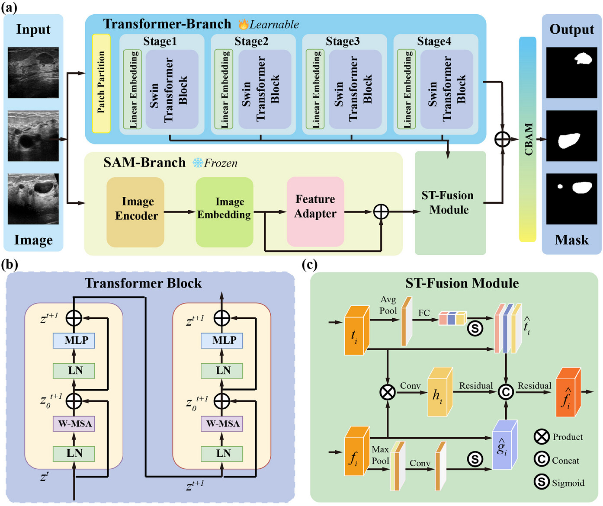

# DSATNet

<p align="center">
  
  <br>
  <rm>Figure 1: DSATNet Architecture</rm>
</p>

**📖 Title:** Dual-Branch Segment Anything Model-Transformer Fusion Network for Accurate Breast Ultrasound Image Segmentation

**👨‍💻 Authors:** Yu Li, Jin Huang, Yimin Zhang, Jingwen Deng, Jingwen Zhang, Lan Dong, Du Wang, Liye Mei, Cheng Lei

**Link:** [DOI🔗](https://doi.org/10.1002/mp.17751) [Project Website🔗](https://github.com/Skylanding/DSATNet)

**📜 Abstract:**
<p align="justify">Precise and rapid ultrasound-based breast cancer diagnosis is essential for effective treatment. However, existing ultrasound image segmentation methods often fail to capture both global contextual features and fine-grained boundary details. This study proposes a dual-branch network architecture that combines the Swin Transformer and Segment Anything Model (SAM) to enhance breast ultrasound image (BUSI) segmentation accuracy and reliability. Our network integrates the global attention mechanism of the Swin Transformer with fine-grained boundary detection from SAM through a multi-stage feature fusion module. We evaluated our method against state-of-the-art methods on two datasets: the Breast Ultrasound Images dataset from Wuhan University (BUSI-WHU), which contains 927 images (560 benign and 367 malignant) with ground truth masks annotated by radiologists, and the public BUSI dataset. Performance was evaluated using mean Intersection-over-Union (mIoU), 95th percentile Hausdorff Distance (HD95), and Dice Similarity coefficients, with statistical significance assessed using two-tailed independent t-tests with Holm–Bonferroni correction. On our proposed dataset, the network achieved a mIoU of 90.82% and a HD95 of 23.50 pixels, demonstrating significant improvements over current state-of-the-art methods with effect sizes for mIoU ranging from 0.38 to 0.61 (p < 0.05). On the BUSI dataset, the network achieved a mIoU of 82.83% and a HD95 of 71.13 pixels, demonstrating comparable improvements with effect sizes for mIoU ranging from 0.45 to 0.58 (p < 0.05). Our dual-branch network leverages the complementary strengths of Swin Transformer and SAM through a fusion mechanism, demonstrating superior breast ultrasound segmentation performance.</p>

# Introduction
This is an official implementation of [DSATNet: Dual-Branch Segment Anything Model-Transformer Fusion Network for Accurate Breast Ultrasound Image Segmentation](https://doi.org/10.1002/mp.17751).

## 🚀 Quick start
### ⚙️ Setup
We ran our experiments with PyTorch 2.0.0, CUDA 11.8 on Ubuntu 20.04.

Assuming that you have installed PyTorch and TorchVision, if not, please follow the [official instructions](https://pytorch.org/) to install them first.
Install the dependencies using cmd:

```bash
pip install -r requirements.txt
```

### 📂 Installation
We have evaluated segmentation performance on two datasets, BUSI-WHU and the public BUSI, with ground truth annotated by radiologists. Please prepare the data as follows:
```
|- DATASET
  |- BUSI_WHU
    |- train
    |  |- img
    |  |  |- img1.bmp
    |  |  |- img2.bmp
    |  |  |- ...
    |  |- mask
    |  |  |- mask1.bmp
    |  |  |- mask2.bmp
    |  |  |- ...
    |- val
    |  |- img
    |  |  |- img1.bmp
    |  |  |- img2.bmp
    |  |  |- ...
    |  |- mask
    |  |  |- mask1.bmp
    |  |  |- mask2.bmp
    |  |  |- ...
    |- test
    |  |- img
    |  |  |- img1.bmp
    |  |  |- img2.bmp
    |  |  |- ...
    |  |- mask
    |  |  |- mask1.bmp
    |  |  |- mask2.bmp
    |  |  |- ...
```

You can download BUSI-WHU from [here](https://data.mendeley.com/datasets/k6cpmwybk3/1)

Training
``` bash
python train.py
```
Evaluation
``` bash
python eval.py
```

## ✏️ 📄 Citation

If you find our work and dataset useful in your research please consider citing our paper:

```
@article{lidual,
  title={Dual branch segment anything model-transformer fusion network for accurate breast ultrasound image segmentation},
  author={Li, Yu and Huang, Jin and Zhang, Yimin and Deng, Jingwen and Zhang, Jingwen and Dong, Lan and Wang, Du and Mei, Liye and Lei, Cheng},
  journal={Medical Physics},
  publisher={Wiley Online Library}
}
```

